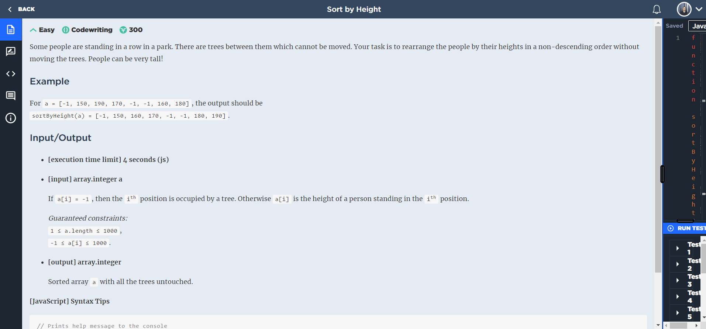
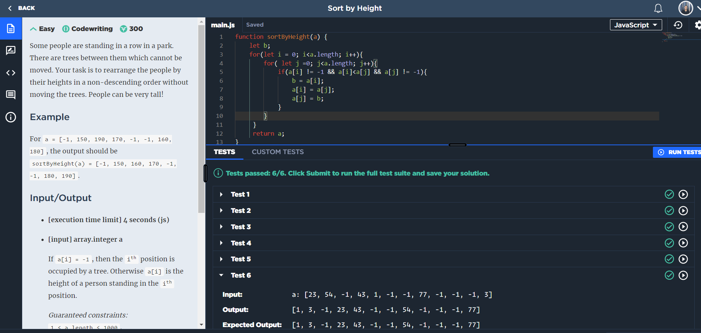

# Sort by Height

## Desafio

## Resposta

### Lógica

* Eu criei 2 loops, um dentro do outro, para que cada índice do array passe por uma condicional em todos os outros índices.
* A condicional análisa se os valores observados são diferentes de -1 e se o valor fixo é menor do que o valor do loop mais interno.
* Caso o valor do loop mais externo seja menor do que o do loop interno, os dois valores trocam de lugar.
* Fazendo está lógica até o fim do loop, temos um array em ordem crescendo sem alterar as posições da "árvores" que de acordo com a história é o -1.